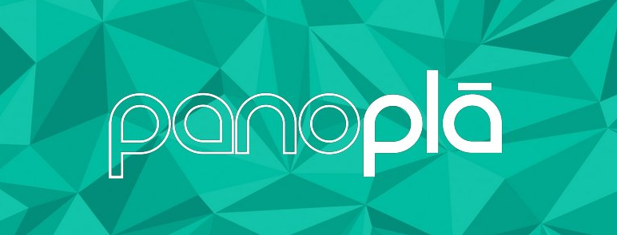

# PanoPla

PanoPla is a CMS for creating and sharing virtual reality and virtual tour content. This plugin is an application for Ubuntu Touch, Canonical's new mobile operating system. 


## Usage

This application is published on the Ubuntu Touch software centre. You can also find it on the unofficial app viewer: https://uappexplorer.com/app/panopla.cmdann

## Editing

You can easily edit this project for your own website by chaning the icon.png and altering the manifest file to reflect your application.

```json
{
    "architecture": "all",
    "description": "Webapp for panopla.com",
    "framework": "ubuntu-sdk-14.10",
    "hooks": {
        "panopla": {
            "apparmor": "panopla.apparmor",
            "desktop": "panopla.desktop"
        }
    },
    "installed-size": "20",
    "maintainer": "Dann Blair <CMDann@gmail.com>",
    "name": "panopla.cmdann",
    "title": "PanoPla",
    "version": "1.0"
}
```

Of course you will need to change fields like `maintainer` to refect your Ubuntu user.

## License 

```
The MIT License (MIT)

Copyright (c) 2015 PanoPla

Permission is hereby granted, free of charge, to any person obtaining a copy
of this software and associated documentation files (the "Software"), to deal
in the Software without restriction, including without limitation the rights
to use, copy, modify, merge, publish, distribute, sublicense, and/or sell
copies of the Software, and to permit persons to whom the Software is
furnished to do so, subject to the following conditions:

The above copyright notice and this permission notice shall be included in
all copies or substantial portions of the Software.

THE SOFTWARE IS PROVIDED "AS IS", WITHOUT WARRANTY OF ANY KIND, EXPRESS OR
IMPLIED, INCLUDING BUT NOT LIMITED TO THE WARRANTIES OF MERCHANTABILITY,
FITNESS FOR A PARTICULAR PURPOSE AND NONINFRINGEMENT. IN NO EVENT SHALL THE
AUTHORS OR COPYRIGHT HOLDERS BE LIABLE FOR ANY CLAIM, DAMAGES OR OTHER
LIABILITY, WHETHER IN AN ACTION OF CONTRACT, TORT OR OTHERWISE, ARISING FROM,
OUT OF OR IN CONNECTION WITH THE SOFTWARE OR THE USE OR OTHER DEALINGS IN
THE SOFTWARE.
```
